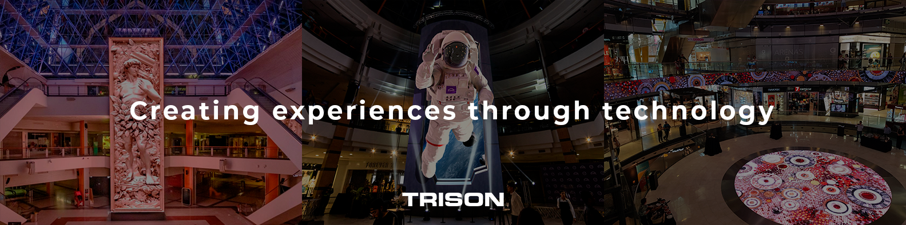

  

<h1 align="center">🎛️ Trison AV Control Development Team</h1>

  <i>Desarrollamos la nueva generación de sistemas de control audiovisual</i>

---

## 🌐 ¿Quiénes somos?

Somos un equipo técnico multidisciplinar especializado en **control AV de alto rendimiento**.  
Diseñamos e implementamos soluciones profesionales para espacios inmersivos, auditorios, showrooms, acuarios, experiencias interactivas y más.

Nos apoyamos en herramientas robustas, APIs abiertas, programación modular y una estética visual limpia y funcional.

---

## 🛠️ Tecnologías

  
  
  
  
  
  
  
  
  
  
  
  
  

---

## 🔒 Cultura interna

> **Privacidad, rigor técnico y código mantenible.**  

---

## 🔗 Contacto interno

Repositorio gestionado por el equipo **GRP_AV_Development@trisonworld.com**  
Acceso limitado a miembros autorizados. Para peticiones técnicas, utiliza los canales corporativos oficiales.

---
